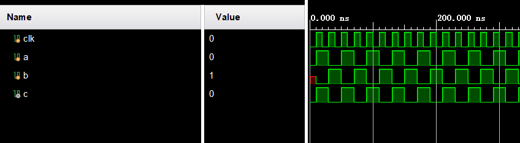

# cpu日志

## lab3 实验环境bug

错误1：ID阶段valid没有更新

错误2：load_op没有赋值

错误3：ALU中or_result错误使用alu_result

错误4：alu传入参数错误

错误5：br_bus(跳转指令)信号少一位

## 基础信息

1. 时序逻辑部分均采取上升沿触发（FPGA利用同一时钟的上下沿会导致效率低下
2. 实现了19条指令，包括跳转指令jal beq bne等
3. 划分为5个流水线级，每一级都有ready_go(是否暂停)，allowin（流水线未暂停 & 当前结果有效 & 下一级流水线准备好接收）和valid（当前结果有效）信号
4. pc复位是赋值bfbffffc，保证nextpc为bfc00000
5. 取指令时采用nextpc，保证取出的是当前pc对应的指令
6. beq指令采用当前（decode阶段对应）pc与offset左移后相加，因为 延迟槽pc=beq指令对应pc+4
7. ALU输出时单独增加mem_addr，减少延迟

## 注释

*上升沿触发*：在时钟的上升沿更新数据

*越沿采样*：采集到时钟上升沿后的数据

*时序逻辑与组合逻辑*：对于两个上升沿触发的时序逻辑模块（如下所示），在上升沿时b只能采集到a上一个周期的数据，因此b的取值永远与a相反；

```verilog
always @(posedge clk)
    a<=~a;
always @(posedge clk)
    b<=a;
```

若将第二个改成组合逻辑，那么上升沿结束后，b将采集到a当周期的值，与a相同

```verilog
always @(posedge clk)
    a<=~a;
assign b=a;
```



