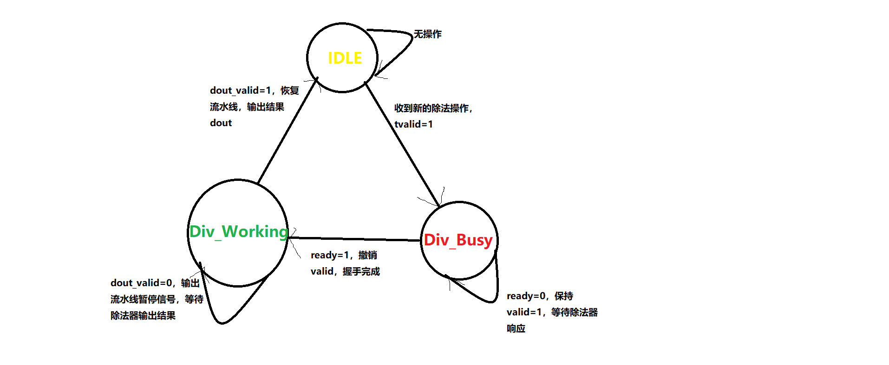

## lab6-添加运算指令

## 一般注意点

1. 根据op_d,func_d,sa_d解码出对应的指令inst_type
2. 根据inst_type生成对应的alu_op
3. 根据inst_type判断src1的操作数来源（rs,pc,sa）
4. 根据inst_type判断src2的操作数来源（rt,8,imm）
5. 根据inst_type判断是否需要读写内存
6. 根据inst_type判断是否需要写寄存器堆
7. 根据inst_type判断写入的目标寄存器（rt或rd或$31)
8. 判断是否需要增加ALU数据通路

## 特殊指令添加

1. ANDI ORI XORI

   添加这组指令时，需要在**ID->EXE**阶段增加数据通路-立即数零扩展（将立即数高16位填0）；

   在进行立即数扩展时，需要将立即数最高位与零扩展型号取反后求与 

   **（imm[15] & ~ zero_extend）**

2. MULT MULTU

   在添加这组指令时，需要调用Xilinx的乘法器IP核，因为Vivado无法自动推导出有符号*；

   调用的IP核利用DSP48实现，不消耗LUT资源，可以在单周期返回；

   结果写入hi lo寄存器中

3. DIV DIVU

   在添加这组指令时，需要调用Xilinx的除法器IP核，Vivado自动推导出的除法器时序过差，影响性能，且同样无法推导出有符号除法；

   添加的IP核结构如下：

   

   IP核采用AXI接口，主要信号具体含义如下：

   | 信号                  | 含义                                             | 方向 |
   | --------------------- | ------------------------------------------------ | ---- |
   | s_axis_divisor_tdata  | 32bit-除数                                       | in   |
   | s_axis_divisor_tready | slave->master 除法器是否准备好接收除数           | out  |
   | s_axis_divisor_tvalid | master->slave 数据是否准备就绪（存在合法操作）   | int  |
   | m_axis_dout_tvalid    | slave->master 结果是否合法（除法操作是否已完成） | out  |

   当tready信号有效，且tvalid信号有效时，流水线与除法器完成一次握手，tready无效，除法器开始运算；

   此时需要将**tvalid**同样置为无效，否则除法器会认为还有一个除法等待运算。

   因此，需要设置一个状态机（上升沿触发），控制tvalid信号，在**收到除法器请求时将tvalid置起**，成功与tready握手后，**将tvalid信号撤销**，完成运算后返回valid有效和运算结果。

   状态机共有3个状态：

   **IDLE**:当前无除法运算，状态机处于空闲状态；

   **Div_Busy**:状态机收到除法运算，将valid信号置起，等待ready信号响应；

   **Div_Working**:状态机正在调用IP和进行除法运算，结束后输出valid和dout

   状态转移图如下所示：

   

4. mfhi mflo mthi mtlo

   **在EXE增加hi、lo两个寄存器**，通过组合逻辑读写。

   ```verilog
   //mthi mtlo
   always @(*) begin
     if(op_div | op_divu) begin
       {hi,lo}=div_result;  
     end
     else if(op_mult | op_multu) begin
       {hi,lo}=mult_result;
     end
     else if(op_mthi) begin
       hi=alu_src1;
     end
     else if(op_mtlo) begin
       lo=alu_src1;
     end  
   end
   ```

## 流水线暂停

在进行除法操作时，需要36个周期，因此需要暂停流水线IF ID EXE三级
